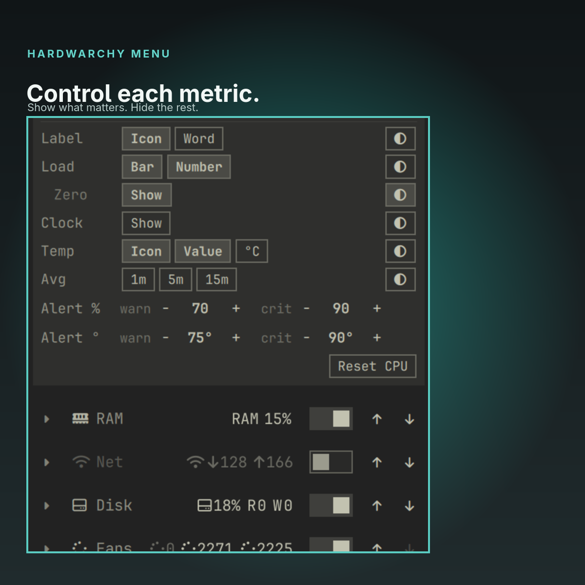

# Hardwarchy

Modular hardware monitoring for Omarchy. Minimal in the bar. Customizable in
the menu.


[View Hardwarchy in the Omarchy marketplace](https://plugins.omarchy.org/plugins/io.github.tymurbogach.hardwarchy).

## Requirements

- Omarchy 4 (Quattro) with `omarchy-shell`.
- `bash`. The plugin needs no `lm_sensors`, vendor tools, kernel modules, or
  privileges.
- `git` only for the optional update check. `omarchy plugin add` uses it too.

Hardwarchy reads `/proc` and `/sys/class/hwmon` directly. It reads only the
providers required for the visible metrics. It fetches its Git remote only when
the menu opens, at most once every six hours.

## Controls

- Click or middle-click a bar metric to open the menu.
- Right-click CPU, GPU, RAM, or Disk to cycle number, gauge, and both.
- Right-click Net or Fans to open the menu.
- Use the keyboard arrows in the menu. Press Enter to activate a control.

## Install

```bash
omarchy plugin add https://github.com/tymurbogach/hardwarchy.git --enable
```

The widget starts in the left bar section. Move it when necessary:

```bash
omarchy bar move io.github.tymurbogach.hardwarchy --section center
```

Hardwarchy imports the settings file from Any Monitor on its first start. The
old plugin does not update in place. Remove it after you confirm that
Hardwarchy works:

```bash
omarchy plugin disable io.github.tymurbogach.any-monitor
omarchy plugin remove io.github.tymurbogach.any-monitor --yes
```

## What it shows

| Group | Metrics |
|---|---|
| CPU | usage, temperature, clock, load average |
| GPU | usage, temperature, clock, VRAM, power |
| RAM | used memory and swap |
| Net | download and upload rates |
| Disk | used space, read rate, write rate |
| Fans | every readable fan |

GPU support covers NVIDIA, AMD, and Intel. Select the source in the menu when
the system has more than one GPU. Select the network interface and disk mount
there too. Network and Disk start off.



## Configure

Open a group card to add or remove its parts, set alert thresholds, and change
the group order. Each fan has its own card row. Rename a fan or hide it when it
stops. The General section sets the temperature unit, color strength, gaps, and
refresh interval.

Hardwarchy saves settings in `~/.config/omarchy/hardwarchy.json`. Missing
settings use defaults. A file from Modular HW Monitor or Any Monitor migrates
on first start.

Optional keys in the widget entry of `shell.json` seed only the first start:

| Key | Default | Purpose |
|---|---:|---|
| `iconGap` | `2` | Gap inside a piece |
| `partGap` | `5` | Gap between pieces |
| `metricGap` | `10` | Gap between read-outs |
| `unit` | `"C"` | Temperature unit |
| `hidden` | `[]` | Metrics hidden before preferences exist |

## Update

Use the **Update to …** button in the menu, or run:

```bash
omarchy plugin update io.github.tymurbogach.hardwarchy
omarchy restart shell
```

The update check runs only for a Git installation. It shows the remote version
without changing the plugin.

## Remove

```bash
omarchy plugin disable io.github.tymurbogach.hardwarchy
omarchy plugin remove io.github.tymurbogach.hardwarchy --yes
```

The remove command keeps your preferences. If you also want to remove them,
run this command:

```bash
rm -f ~/.config/omarchy/hardwarchy.json
```

## Troubleshooting

If a QML change does not appear, restart the shell. Disable and enable do not
reload QML already held by `omarchy-shell`.

```bash
omarchy restart shell
```

If a metric is unavailable, the system did not expose its source through
`/proc` or `/sys`. Hardwarchy shows no fake zero for an unavailable sensor.

## License

MIT. See [LICENSE](LICENSE).
