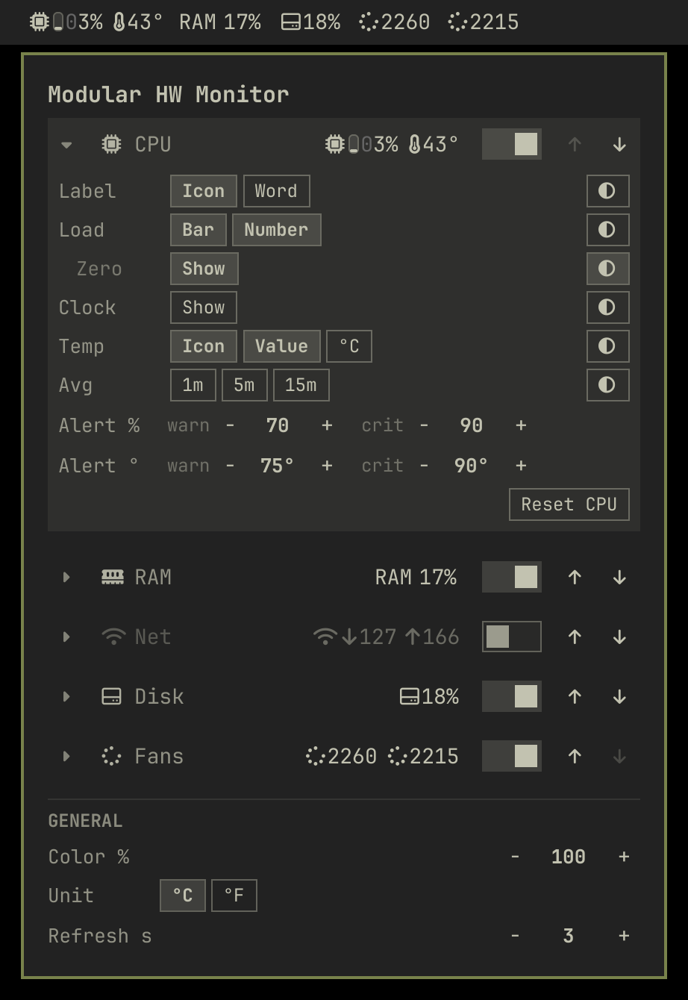

# Modular HW Monitor

CPU, GPU, memory, network, disk and every fan on the machine — one
compact read-out each, straight in the [Omarchy](https://omarchy.org/)
bar, built piece by piece the way you want it.

**Click a metric to open the menu. Every piece of every read-out has its
own row: add it, remove it, mute it.** Keep the two or three you actually
watch; the rest stay one click away.



*The bar keeps CPU usage, CPU temp and one fan. The menu lists everything
the machine reports — including what is hidden, still updating, so you
can decide whether to bring it back.*

## Why

A monitor that shows everything is a monitor you stop reading. This
ThinkPad reports three fans, one a phantom `acpi_fan` that never leaves
0 RPM, and all of it competed for bar space with the two numbers
actually worth a glance.

So the read-out is a set of independent pieces rather than one string.
Every group is its own click target and opens the menu, which is the
switchboard: each card names its group outright — CPU, GPU, RAM, Net,
Disk, Fans — with a live preview of what it puts on the bar. Nothing is
hard-coded to one machine: a fanless laptop shows three read-outs, a
desktop with four fans shows seven, and either way you choose which
reach the bar, in which order, and what each one draws.

## What it shows

| Group | Readings |
|---|---|
| CPU | usage, temperature, clock, load average |
| GPU | usage, temperature, clock, VRAM, power (NVIDIA, AMD or Intel; you pick the source) |
| RAM | used (% and GiB), swap |
| Net | download and upload rates of the interface you pick (or the busiest one) |
| Disk | space used on the mount you pick, read and write rates |
| Fans | every readable fan, by name |

Network and Disk start switched off. A machine that exposes nothing
readable for a group simply lists no card for it instead of zeros.

Temperature prefers the real CPU package sensor — `Tctl`/`Tdie` on AMD,
`Package id 0` on Intel — and falls back to the hottest readable sensor.

GPU readings are best-effort and need no privileges: `nvidia-smi` on
NVIDIA, `gpu_busy_percent` plus the `amdgpu` sensor on AMD, summed engine
`busy_time` on Intel (i915 and xe). With more than one, the GPU card's
**Source** row picks which one to read.

Two fans that report the same label get their chip appended, so a
machine with `acpi_fan/fan1` and `thinkpad/fan1` shows *fan1
(acpi_fan)* and *fan1 (thinkpad)* rather than two rows you cannot tell
apart — and you can rename either.

## Use

- **Click a metric** — open the menu: one card per group, with a live
  preview of its read-out and a switch
- **Click a card, or its chevron** — open that group's rows
- **Right-click a read-out** — cycle its load: number, bar, both (on
  Network and Fans it opens the menu); middle-click opens the menu too
- **Keyboard** — ↑ ↓ walk every line; on a card → opens it, ← closes it
  and Enter switches it; on a row ← → walk its buttons and Enter presses

### Build each read-out your way

Each group draws one read-out (each fan its own), left to right. An open
card lists one row per piece, in the same order. The chips on the left
**add or remove** — light several and you get all of them — and every
row ends with its own **Quiet** chip, a half-filled circle at the far
right: the piece takes the muted color and never warms. For CPU:

| Row | Chips | Draws |
|---|---|---|
| Label | Icon · Word | the chip glyph, `CPU`, both, or nothing |
| Load | Bar · Number | a vertical gauge, `12%`, or both |
| ↳ Zero | Show | the leading zero under 10% (`05%` or `5%`) |
| Clock | Show | `3.2G` |
| Temp | Icon · Value · °C | thermometer, `58`, unit letter |
| Avg | 1m · 5m · 15m | the load average windows you pick |

GPU has the same rows plus **Source**, **VRAM** (Bar · % · GiB) and
**Power**. RAM has **Used** (Bar · % · GiB), **Zero** and **Swap**. Net
has **Link**, then **Down** and **Up** (Icon · Value, the icon an arrow).
Disk has **Mount**, **Used**, **Zero**, **Read** and **Write** (Tag ·
Value, the tag R or W). Fans have **RPM** (Value · Unit), **Stopped**
(hide the ones at 0 RPM) and one line per fan: switch, name (click the
pencil to rename; empty resets), value, move up or down.

Every card ends with its own **alerts** — warn and crit, so a GPU that
runs hot can have a higher crit than the CPU — and **Order** (Up · Down)
plus **Reset** for that card alone. A reading warms toward the theme's
urgent color between warn and crit; the label warms with the hottest
reading it names. A card that is on but draws nothing says *nothing
shown*.

The **General** section holds Color % (how strongly warming applies,
0 to 100), the temperature unit, the three gaps (inside a piece, between
pieces, between read-outs), the refresh interval and Reset all.

A vertical bar always draws numbers. The exact figures behind any gauge
live in the tooltip and the menu.

Everything is remembered in `~/.config/omarchy/modular-hw-monitor.json`
and survives a reboot, a shell restart and `omarchy refresh shell`:

```json
{"version": 2, "order": ["cpu", "gpu", "mem", "net", "disk", "fan"],
 "groups": {"cpu": {"enabled": true,
                    "label": {"icon": true, "word": false, "quiet": false},
                    "load": {"bar": true, "number": false, "quiet": false},
                    "clock": {"show": true, "quiet": false},
                    "temp": {"icon": false, "value": true, "unit": false, "quiet": true}},
            "fan": {"enabled": true, "showStopped": false,
                    "names": {"fan:thinkpad/fan1": "CPU fan"}}},
 "unit": "C", "colorIntensity": 100,
 "gaps": {"icon": 2, "part": 5, "metric": 10}, "refresh": 3}
```

Groups, pieces and toggles left out of the file take their defaults. A
prefs file from 1.0 upgrades itself on first load.

A fan is remembered by its hwmon id, never by its position, so loading
a module or docking the machine cannot hide a different fan than the one
you hid. Hiding everything leaves a single dimmed chip on the bar —
the way back to the menu, rather than a zero-pixel hole.

## Install

```bash
omarchy plugin add https://github.com/tymurbogach/omarchy-modular-hw-monitor.git --enable
```

The widget mounts in the right bar section. Move it with:

```bash
omarchy bar move io.github.tymurbogach.modular-hw-monitor --section center
```

Update later with:

```bash
omarchy plugin update io.github.tymurbogach.modular-hw-monitor
```

> Reinstalls from a fresh clone: if you carried a checkout from before
> the 1.0 rewrite, remove the plugin and add it again rather than
> updating, so no stale file survives.

## Remove

```bash
omarchy plugin disable io.github.tymurbogach.modular-hw-monitor   # take it off the bar
omarchy plugin remove io.github.tymurbogach.modular-hw-monitor    # delete it
rm -f ~/.config/omarchy/modular-hw-monitor.json                   # forget the prefs
```

## Requirements

- Omarchy 4 (Quattro) with `omarchy-shell`
- `bash` — nothing else. No `lm_sensors`, no kernel modules, no vendor tools.

Readings come from `/proc/stat`, `/proc/meminfo`, `/proc/cpuinfo`,
`/proc/loadavg`, `/proc/net/dev`, `/proc/diskstats`, `/proc/mounts` and
`/sys/class/hwmon`, all readable without privileges.

The collector reads only what the bar draws: a group or piece you
switch off is not read at all. While the menu is open it reads
everything, so the previews stay live. It finds the sensor files once
and reads them with shell builtins, so a reading costs about 10 ms of
CPU.

## Settings

Optional, in the widget's `shell.json` layout entry. These are a
first-run seed only — afterwards the JSON prefs file, and the menu, are
the source of truth:

| Key | Default | What it does |
|---|---|---|
| `iconGap` | `2` | Pixels inside one piece: a mark and its reading, a gauge and its digits |
| `partGap` | `5` | Pixels between two pieces of one read-out |
| `metricGap` | `10` | Pixels between one read-out and the next |
| `hidden` | `[]` | Metric keys folded away before the prefs file exists |
| `unit` | `"C"` | `"F"` for Fahrenheit |
| `showRpm` | `false` | Spell out RPM on the bar |
| `mode` | `"digits"` | `"gauges"` (bar and digits, unless `showDigits` is `false`) |
| `showDigits` | `true` | `false` keeps a `"gauges"` seed to the bar alone |
| `wordLabels` | `false` | Words instead of glyphs, for every group |
| `colorMode` | `"auto"` | `"graphite"` never warms (Color % 0) |
| `showClocks` | `false` | CPU/GPU clocks after the load |
| `ramFormat` | `"percent"` | `"used"` shows memory as used over total GiB |

The gaps are measured against the ink, not the character cell, so one
number means the same visual distance under every icon.

## Development

`dev.qml` is a Quickshell harness that draws the read-out with the
**same** `MetricButton` the bar uses, in a plain window, so it runs on
any Wayland desktop and what you see is what ships:

```bash
quickshell -p dev.qml
```

Photograph states straight from a cold start. Every variable takes the
prefix `MODULAR_HW_MONITOR_`:

| Variable | Effect |
|---|---|
| `HIDDEN` | Comma-separated metric keys to hide |
| `ENABLE` | Comma-separated groups to switch on (`net,disk`) |
| `PARTS` | `group.part=toggle,toggle` entries split by `;`: the toggles named turn on, the rest of that part off; `quiet` mutes it |
| `COLOR` | Color % from 0 to 100 |
| `FAKE_GPU=1` / `FAKE_LOAD=1` | Invent a GPU / a hot machine |
| `FONT` | Font family to draw with |

```bash
MODULAR_HW_MONITOR_PARTS='cpu.load=bar,number;cpu.temp=icon,value,unit' quickshell -p dev.qml
MODULAR_HW_MONITOR_ENABLE=net,disk MODULAR_HW_MONITOR_PARTS='disk.used=percent,gib' quickshell -p dev.qml
MODULAR_HW_MONITOR_PARTS='cpu.label=;cpu.temp=value,quiet' MODULAR_HW_MONITOR_FAKE_LOAD=1 quickshell -p dev.qml
```

In the harness, clicking a read-out cycles its load.

The collector runs on its own:

```bash
./scripts/sysread                      # one reading
./scripts/sysread --loop --interval 2  # stream one reading every 2 seconds
MONITOR_NET_IFACE=wlan0 MONITOR_ROOT_MOUNT=/home ./scripts/sysread   # other sources
```

Set `MONITOR_HWMON_ROOT` to a directory of fake `hwmon` nodes to test
machines you do not have. Tests:

```bash
node tests/model-tests.js   # pure-logic tests
bash tests/collector-tests.sh
```

## A note on reloading

Editing an installed plugin's QML is not picked up by `omarchy plugin
disable`/`enable`, nor by `omarchy-shell shell rescanPlugins` — both
leave the already-loaded QML in memory. Restart the shell instead:

```bash
omarchy-restart-shell
```

## License

MIT — see [LICENSE](LICENSE).
